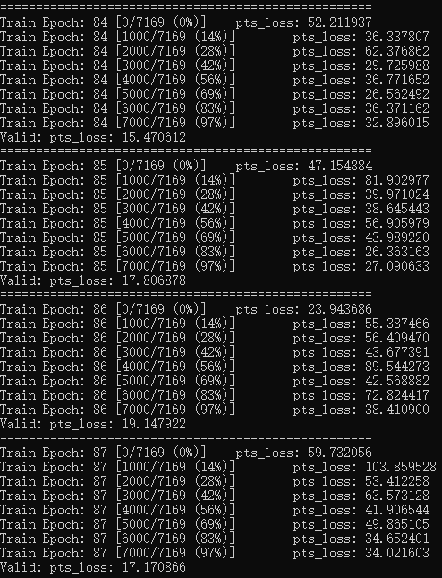
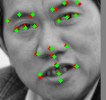
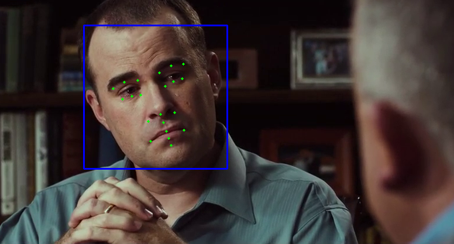

## 说明
	利用CNN网络来进行人脸关键点检测，采用了21点的预测方案

## Installation
	pip install torchvision
	pip install torch
	pip install numpy
	pip install opencv-python
	
## Download data
	链接：https://pan.baidu.com/s/1CDfa97a8dQye7tto6BVcjA 
	提取码：lulj
	解压至工程目录下

## Train
	python .\detector.py --phase "train"
	

## Test
	python .\detector.py --phase "test"
	

	
## Test
	python .\detector.py --phase "predict"
	

